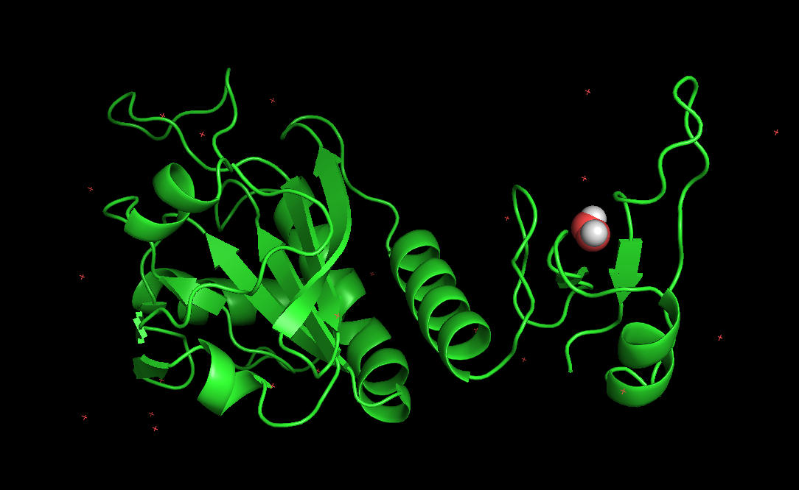

# Docking Process

### Software prep (on Mac, x86_64 chip)
- obabel: `brew install open-babel`
- biopython: `pip install biopython`
- autodock vina: `brew install autodock-vina`
- pymol: `brew install pymol`

AutoDockTools
- download link: `https://ccsb.scripps.edu/mgltools/downloads/` (mgltools_1.5.7_MacOS-X.tar.gz (tarball installer 85Mb))
- install the downloaded software, follow the README in the downloaded repo (I ran ./install.sh and it's done)
- permission issue on Mac: use spctl to enable ran exectable from internet

### Program running
1. download enzyme cif file from Protein Data Bank (https://www.rcsb.org/)
2. download substrate sdf file from ChEBI (https://www.ebi.ac.uk/chebi/)
3. use biopython to extract target chain (see dock.ipynb)
4. obabel to convert cif to pdb `obabel 5b6m_chainA.cif -O 5b6m_chainA.pdb`
5. AutoDockTools to convert receptor pdb to pdbqt `/path/to/autodock/bin/python2 /path/to/autodock/MGLToolsPckgs/AutoDockTools/Utilities24/prepare_receptor4.py -r 5b6m_chainA.pdb -o 5b6m_chainA.pdbqt`
6. obabel to convert substrate sdf to pdbqt `obabel CHEBI_16240.sdf -O substrate.pdbqt`
7. vina to docker enzyme and substrate. As we do not know interface, use whole protein as search box (see dock.ipynb)

### Demo files
Enzyme: 5b6m, substract: CHEBI_16240, EC group: 3.1.1, index: 2, binding: Yes

`5b6m.cif.gz`: original downloaded file from PDB

`5b6m.cif`: unzipped from `5b6m.cif.gz`

`5b6m_chainA.cif`: extracted chain A from 5b6m

`5b6m_chainA.pdbqt`: enzyme ready to use for autodock-vina

`ChEBI_16240.sdf`: downloaded from ChEBI

`substrate.pdbqt`: substrate ready to use for autodock-vina

`docking_results`: dock result

### Visualize
`pymol 5b6m_chainA.pdb docking_results.pdbqt`

